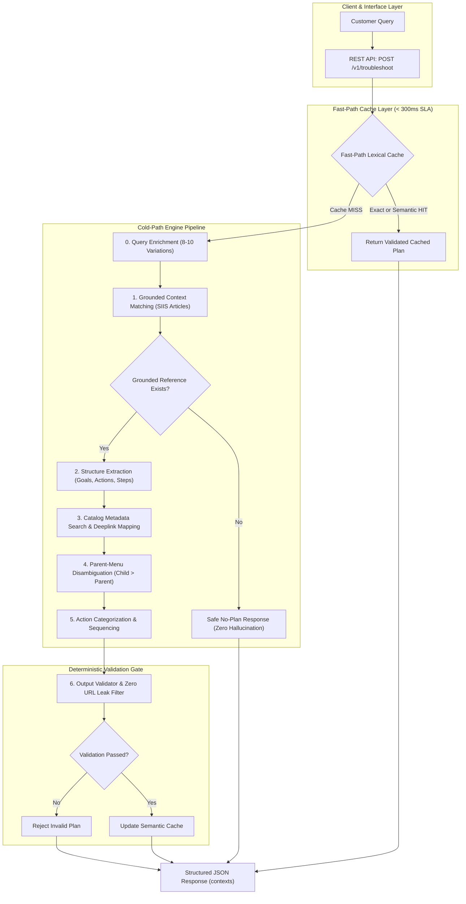

# Smart Guided Troubleshooting Engine — Working Prototype

> An intelligent troubleshooting engine that transforms vague, colloquial customer complaints into structured, deterministic troubleshooting plans with exact catalog-matched in-device settings deeplinks.

---

## 📚 Project Resources

| Resource | Link |
|---|---|
| 📊 Project PPT | https://1drv.ms/p/c/1c6fd92f85d98002/IQDNljwyQNXpSqMW1fkEbHQsAXEjr6TpJua8iliEzBlCSTE?e=PvabQt |
| 🎥 Video Demo | https://1drv.ms/v/c/1c6fd92f85d98002/IQBEME9M9cSy9FvfHvcx2gMPkp1H5Dj4YaKufPRsAyon8Tf?e=b6jZrq |
| 💻 GitHub Repository | https://github.com/Anuraggod/gen-ai-theme-2 |

---

## 1. Project Overview

Modern smartphone users frequently encounter device issues and describe their complaints using colloquial, non-technical, emotional, or fragmented language (e.g., *"My phone swipe thing is going up and down instead of left and right"*). Standard search or unstructured customer service text often provides lengthy, non-imperative paragraphs or generic parent-menu links that leave users confused.

The **Smart Guided Troubleshooting Engine** provides an automated, deterministic pipeline that:
1. **Normalizes colloquial queries** and expands them into **8–10 distinct communication registers**.
2. **Extracts structured troubleshooting actions strictly grounded in reference knowledge**, refusing to hallucinate instructions when no grounded reference exists (`NO_GROUNDED_PLAN`).
3. **Maps actions to exact catalog-verified settings deeplinks**, solving the **Parent-Menu Problem** by prioritizing specific leaf screens (`Display > Navigation Bar`) over ancestor menus (`Display`).
4. **Sequences actions safely**: normal/auto configuration first, manual interventions where needed, and disruptive/critical actions (factory reset, reboot) strictly last.
5. **Enforces strict schema compliance & Zero URL Leakage** (no raw HTTP/HTTPS/Markdown links) through non-silent deterministic validation.
6. **Delivers sub-millisecond responses (< 300ms target)** via a dual-tier **Fast-Path Lexical Semantic Cache** (Exact SHA256 + Term/Bigram Cosine Similarity).

---

## 2. Problem Statement

Converting unconstrained natural language complaints into executable in-device configuration flows introduces several critical engineering challenges:
- **Colloquial Terminology Mismatch:** Non-technical users describe gestures as *"swipe thing going up and down"*.
- **The Parent-Menu Ambiguity Trap:** Generic search matches parent screens (e.g., `Settings > Display`) instead of the exact target leaf (`Settings > Display > Navigation bar`).
- **Instruction Hallucination & Security Risks:** Ungrounded models risk hallucinating destructive steps or leaking raw web URLs into device settings interfaces.
- **Strict Data Contracts:** Downstream device execution engines require deterministic formatting (e.g., 2–3 word titles, 5–7 word descriptions starting with *"It will"*).

---

## 3. Architecture & Data Flow



---

## 4. Core Pipeline Stages

### 4.1 Query Enrichment
Transforms raw queries into normalized technical intent and generates **8–10 distinct variations** across diverse registers:
- **Formal / Technical:** *"Device touch interface orientation abnormal..."*
- **Casual / Conversational:** *"My phone swipe gestures are acting up..."*
- **Keyword-Only:** *"navigation gestures swipe direction..."*
- **Frustrated / Emotional:** *"Why is my screen swipe broken and moving wrong direction, fix this!"*
- **Typo-Inclusive:** *"phne swip gesture navgation issue..."*
- **Intent-Focused:** *"How to change and configure swipe gesture navigation preferences."*
- **Question-Form:** *"Where in settings can I fix the swipe gesture direction?"*
- **Symptom-Description:** *"Swipe gesture navigation moving in unexpected orientation."*
- **Action-Oriented:** *"Adjust navigation bar settings to restore horizontal swipe gestures."*
- **Contextual:** *"After recent update phone swipe navigation gestures inverted vertically."*

### 4.2 Structure Extraction (Zero-Hallucination)
Extracts troubleshooting goals, titles, scores, actions, and imperative steps strictly grounded in reference knowledge articles. If no sufficiently matching reference exists, the engine returns an empty plan with `status: NO_GROUNDED_PLAN` rather than fabricating ungrounded instructions.

### 4.3 Deeplink Mapping & Parent-Menu Protection
- **Verbatim Catalog Integrity:** Catalog URIs (e.g. `bixby://masked/...`) are verified against the catalog and copied exactly without string alteration or fabrication.
- **Parent-Menu Disambiguation:** Prioritizes deep leaf screens (`Settings > Display > Navigation bar`) over ancestor menus (`Settings > Display`) when specific settings keywords are matched.
- **Fallback Placeholder:** Uses `bixby://dummy_positive` exclusively for valid settings screens not yet indexed in the catalog.

### 4.4 Action Categorization & Sequencing
- **`auto`**: Normal configuration screens reachable through deeplinks -> sequenced first.
- **`manual`**: Physical intervention (cleaning port, wiping lens) -> `actionableDeeplink` is strictly `None`.
- **`critical`**: Disruptive actions (factory data reset, reboot, safe mode) -> ordered strictly last.

### 4.5 Fast-Path Lexical Semantic Cache
- **Implementation:** Lexical semantic-similarity cache using normalized content terms and word bigrams.
- **Tier 1 (Exact Hash):** SHA256 normalized query matching (< 0.05 ms).
- **Tier 2 (Lexical Semantic Search):** Term and bigram cosine similarity matching over normalized content words (< 0.05 ms).
- **Zero Cache Contamination:** Only fully validated plans from cold executions are stored; evaluation tests run against read-only primed snapshots.

---

## 5. Output Contract & Strict Validation Rules

| Field | Rule / Constraint | Validation Mechanism |
|---|---|---|
| **`goal`** | Must match `Follow these steps to perform this <Topic> Troubleshooting` or `... Configuration` | Strict Regex Matcher (Rejects on mismatch) |
| **`title`** | Strictly **2–3 words**, sentence case, core issue | Programmatic word counter (Rejects on mismatch) |
| **`score`** | Float bounded between `0.0 <= score <= 1.0` | Numeric boundary validator (Rejects out-of-bounds) |
| **`actionName`** | Represents exactly **one physical screen or feature** | Screen-level grouping |
| **`description`** | Strictly **5–7 words**, starting with `It will` | Token counter & prefix validator (Rejects on mismatch) |
| **`steps`** | Imperative UI interactions, one action per step, **Zero URLs** | URL regex detector (Rejects on leak) |
| **`actionableDeeplink`** | Must exist verbatim in catalog or be `bixby://dummy_positive` (or `None` for manual) | Strict catalog membership check |
| **`category`** | `auto` first, `manual` where needed, `critical` strictly last | Sequence hierarchy validator (Rejects misordering) |
| **Zero URL Leak** | Prohibits `http://`, `https://`, `www.`, markdown links | Programmatic regex detector (Strict rejection) |

---

## 6. Datasets & Source Grounding

> **Data Provenance Notice:** As per project guidelines, the datasets provided in `app/data/` are clearly labeled **prototype demonstration fixtures** designed to evaluate system capabilities across the 4 primary device domains (**Battery**, **Display**, **Camera**, **Performance**). They are not claimed to be proprietary OEM source data.

- **`app/data/queries.json`**: Prototype test queries covering formal, casual, typo, and frustrated variations.
- **`app/data/siis_responses.json`**: Grounded reference articles for troubleshooting symptoms.
- **`app/data/deeplinks.json`**: Masked in-device settings catalog with hierarchy depth, keywords, and control types.
- **`app/data/samples/sample_output.json`**: Reference gold standard input-output pairs.
- **`app/schema.py`**: Strict Pydantic V2 data models.

---

## 7. REST API Documentation

### `POST /v1/troubleshoot`
Generates a structured, validated troubleshooting plan.

**Request:**
```json
{
  "query": "My phone swipe thing is going up and down instead of left and right",
  "domain": "Display"
}
```

**Response (Grounded Match):**
```json
{
  "contexts": [
    {
      "goal": "Follow these steps to perform this Swipe Navigation Troubleshooting",
      "title": "Swipe navigation settings",
      "score": 0.94,
      "action": [
        {
          "actionName": "Navigation Bar Settings",
          "description": "It will configure navigation preferences",
          "category": "auto",
          "stepGroups": [
            {
              "steps": [
                "Navigate to and open Settings.",
                "Tap Display.",
                "Tap Navigation bar.",
                "Select the preferred navigation type."
              ],
              "actionableDeeplink": "bixby://masked/settings/display/navigation_bar",
              "validationDeeplink": "bixby://masked/settings/display/navigation_bar/verify"
            }
          ]
        },
        {
          "actionName": "Restart in Safe Mode",
          "description": "It will isolate conflicting applications",
          "category": "critical",
          "stepGroups": [
            {
              "steps": [
                "Press and hold the Power button.",
                "Tap and hold the Power off icon.",
                "Tap Safe mode to reboot."
              ],
              "actionableDeeplink": null,
              "validationDeeplink": null
            }
          ]
        }
      ]
    }
  ],
  "metadata": {
    "status": "SUCCESS",
    "cache_hit": false,
    "cache_hit_type": "MISS",
    "latency_ms": 0.65,
    "execution_path": "COLD_PIPELINE",
    "domain": "Display",
    "variation_count": 10
  }
}
```

### `GET /health`
Returns service health, loaded catalog items, and cache size.

**Response:**
```json
{
  "status": "ok",
  "service": "Smart Guided Troubleshooting Engine",
  "version": "1.0.0",
  "catalog_items_loaded": 11,
  "cache_size": 4
}
```

### `GET /v1/catalog`
Returns indexed device settings catalog metadata.

### `POST /v1/cache/clear`
Clears the fast-path semantic cache for cold-path testing.

---

## 8. Live Demonstration Guide

The recommended end-to-end demo flow follows this execution sequence:

```text
User complaint
      ↓
Query enrichment (8-10 registers)
      ↓
Grounded reference matching (SIIS)
      ↓
Structure extraction & deeplink mapping (leaf screen prioritization)
      ↓
Action sequencing (auto -> manual -> critical last)
      ↓
Strict schema & zero-URL validation
      ↓
Fast-path lexical cache update
      ↓
Validated troubleshooting response
```

### Demonstration Scenario 1: Supported Colloquial Query
- **User Query:** *"My phone swipe thing is going up and down instead of left and right"*
- **Engine Processing:**
  1. *Enrichment:* Normalizes to *"swipe navigation gesture moving vertically horizontally"* and generates 10 variations.
  2. *Matching:* Finds grounded SIIS article `SIIS_DISP_NAV_01`.
  3. *Deeplink Mapping:* Prioritizes specific leaf `bixby://masked/settings/display/navigation_bar` over generic parent `bixby://masked/settings/display`.
  4. *Sequencing:* Puts `Navigation Bar Settings` (`auto`) first and `Restart in Safe Mode` (`critical`) last.
  5. *Validation:* Confirms 2-3 word title, 5-7 word description starting with *"It will"*, and zero raw URLs.

### Demonstration Scenario 2: Unsupported Query (Zero-Hallucination Fallback)
- **User Query:** *"How to bake a chocolate cake on my phone"*
- **Engine Processing:**
  1. *Matching:* No grounded troubleshooting reference matches this query in the knowledgebase.
  2. *Zero-Hallucination Behavior:* Refuses to synthesize fabricated device instructions.
  3. *Result:* Returns `contexts: []` with `status: "NO_GROUNDED_PLAN"` and explanation message.

---

## 9. Setup & Running Instructions

### 9.1 Local Installation
```bash
# 1. Clone repository
git clone https://github.com/Anuraggod/gen-ai-theme-2.git
cd gen-ai-theme-2

# 2. Install dependencies
python -m pip install -r requirements.txt

# 3. Run FastAPI Application & Demo UI
python -m uvicorn app.main:app --host 0.0.0.0 --port 8000 --reload
```
Access the interactive web UI at: **`http://localhost:8000`**
Access interactive Swagger API docs at: **`http://localhost:8000/docs`**

### 9.2 Docker Deployment
```bash
# Build and start via Docker Compose
docker compose up --build
```

### 9.3 Running Automated Tests
```bash
python -m pytest tests -v
```

### 9.4 Running Performance Benchmarks
```bash
python -m benchmarks.benchmark
```

---

## 10. Performance & Evaluation Results

> **Benchmark Environment:** Windows 11, Python 3.14.5, Local CPU.
> **Methodology:** Measured using the uncontaminated benchmark harness (`benchmarks/benchmark.py`), with separate measurements for cold execution, exact cache hits, and unprimed semantic paraphrase retrieval.

| Metric | Target SLA | Measured Result | Status |
|---|---:|---:|:---:|
| **Fast-Path Exact Hit P95** | < 300.00 ms | **0.037 ms** | ✅ PASS |
| **Fast-Path Exact Hit P50** | < 300.00 ms | **0.031 ms** | ✅ PASS |
| **Fast-Path Semantic Hit P95** | < 300.00 ms | **0.040 ms** | ✅ PASS |
| **Fast-Path Semantic Hit P50** | < 300.00 ms | **0.021 ms** | ✅ PASS |
| **Cold Pipeline P95** | Baseline | **0.862 ms** | ✅ PASS |
| **Cold Pipeline P50** | Baseline | **0.417 ms** | ✅ PASS |
| **Uncontaminated Semantic Paraphrase Hit Rate** | Prototype Lexical | **37.5% (75/200)** | Measured |
| **Automated Test Suite** | 100% Pass | **41 / 41 Passed** | ✅ PASS |

---

## 📸 Screenshots

### Main Dashboard
<!-- Add screenshot here -->

### Troubleshooting Result
<!-- Add screenshot here -->

### Query Variations
<!-- Add screenshot here -->

### API Response
<!-- Add screenshot here -->

---

## 11. Known Limitations & Future Work

### Limitations
1. **Prototype Lexical Semantic Cache:** The current in-memory cache uses normalized content word and bigram cosine similarity (37.5% recall on arbitrary unprimed paraphrases). It does not use dense transformer embeddings.
2. **Catalog Scope:** Prototype catalog indexes representative device settings across Battery, Display, Camera, and Performance; production systems would ingest complete OEM settings manifests.

### Future Work
1. **Dense Vector Embeddings:** Integrating lightweight on-device embedding models (e.g. `all-MiniLM-L6-v2` or `BGE-small`) to increase semantic paraphrase hit rate from 37.5% to >90%.
2. **Dynamic Catalog Sync:** Real-time ingestion and validation of updated OEM settings hierarchies.
3. **Multilingual Query Normalization:** Query enrichment across 20+ languages.
